# Side-Track

> A React Native iOS weight-training app with a random workout picker, muscle-specific fatigue tracking, local leaderboard rankings, and Apple Health integration.

## What It Does

Side-Track removes decision fatigue from your gym routine. Instead of scrolling through plans, you hit **Randomize** and the app picks an exercise, weight, and rep target based on your goals and current muscle freshness.

### Core Features

- **Random Workout Generator** — Spin for a training-goal-aligned exercise (strength / hypertrophy / endurance). Filters out exercises targeting muscles below 30% capacity.
- **Muscle-Specific Fatigue Engine** — Tracks per-muscle capacity in SQLite with science-based recovery rates (e.g., quads recover ~1.2%/hour, biceps ~2.5%/hour).
- **1RM Auto-Estimation** — Uses multiple formulas (Epley, Brzycki, Lombardi, O'Conner) to estimate one-rep max from your workout history.
- **Local SQLite Database** — Per-user database files with full workout history, goals, capacity tracking, and settings.
- **Leaderboard** — Global and location-based rankings via Supabase, with smart filtering by time range, score type, and location.
- **Apple Health / HealthKit Sync** — Bi-directional workout and calorie sync (iOS). Android Health Connect support planned.
- **Apple Sign-In** — Native Apple authentication + Supabase session management.
- **Workout History & Stats** — Review past sessions, track volume progression, and visualize trends.

---

## Architecture Overview

Side-Track is a **local-first** mobile app. Workout data, fatigue state, and 1RM estimates live in on-device SQLite. Supabase handles authentication and aggregated leaderboard scores only.

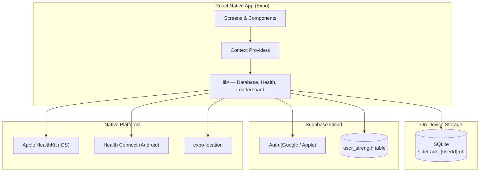

### Context Provider Hierarchy

React context layers data and side effects across the app:

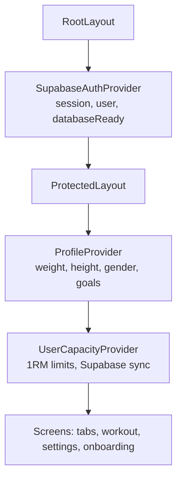

| Provider | File | Responsibility |
|----------|------|----------------|
| `SupabaseAuthProvider` | `context/SupabaseAuthContext.tsx` | OAuth (Google/Apple), session lifecycle, per-user DB init |
| `ProfileProvider` | `context/ProfileContext.tsx` | Body metrics, calorie goals, profile CRUD |
| `UserCapacityProvider` | `context/UserCapacityContext.tsx` | Exercise 1RM limits, auto-estimation, debounced leaderboard sync |

---

## Navigation & Routing

The app uses [Expo Router v5](https://docs.expo.dev/router/introduction/) with file-based routes under `app/`.

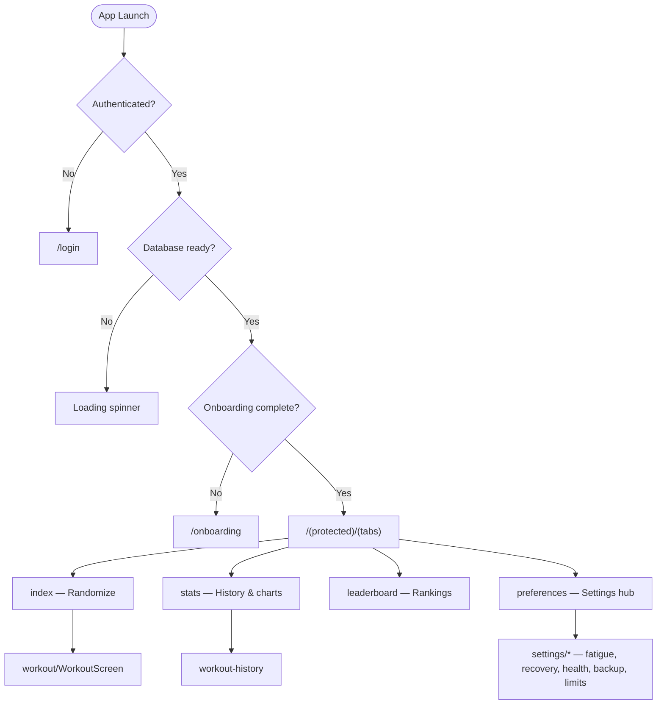

### Main Tab Screens

| Tab | Route | Purpose |
|-----|-------|---------|
| Home | `(tabs)/index.tsx` | Slot-machine randomizer → active workout |
| Stats | `(tabs)/stats.tsx` | Volume trends, exercise history |
| Rankings | `(tabs)/leaderboard.tsx` | Global/country leaderboard with filters |
| Settings | `(tabs)/preferences.tsx` | Links to deep settings pages |

---

## Authentication Flow

Sign-in uses Supabase Auth with Google OAuth (all platforms) and native Apple Sign-In (iOS). On successful login, a user-specific SQLite database is opened.

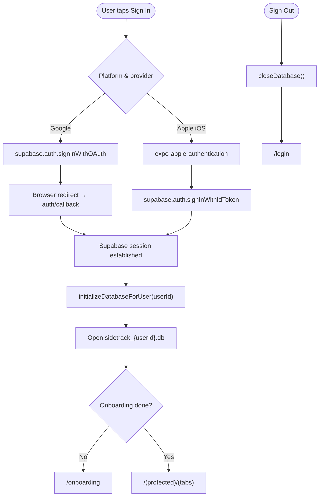

Auth API routes live in `app/api/auth/` for token exchange, session management, and Apple native auth callbacks.

---

## Onboarding Flow

First-time users complete a 5-step wizard before accessing the main app. Completion is stored in SQLite (`user_preferences.onboarding_completed`).

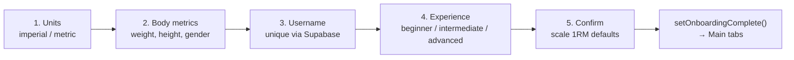

Experience level scales default 1RM values (beginner ×0.7, intermediate ×1.0, advanced ×1.3). Usernames are validated against the `user_strength` table for uniqueness.

---

## Random Workout Generator

The home screen **Randomize** button is the core loop. It respects muscle fatigue and personal 1RM data.

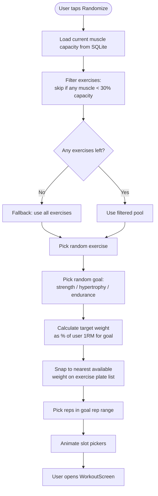

### Training Goal Presets

| Goal | Rep Range | % of 1RM |
|------|-----------|----------|
| Strength | 1–5 | 80–100% |
| Hypertrophy | 6–12 | 65–80% |
| Endurance | 15–30 | 40–60% |

---

## Workout Logging & Fatigue Engine

When a set is logged, the app writes to SQLite, drains muscle capacity, updates 1RM estimates, and optionally queues a HealthKit write.

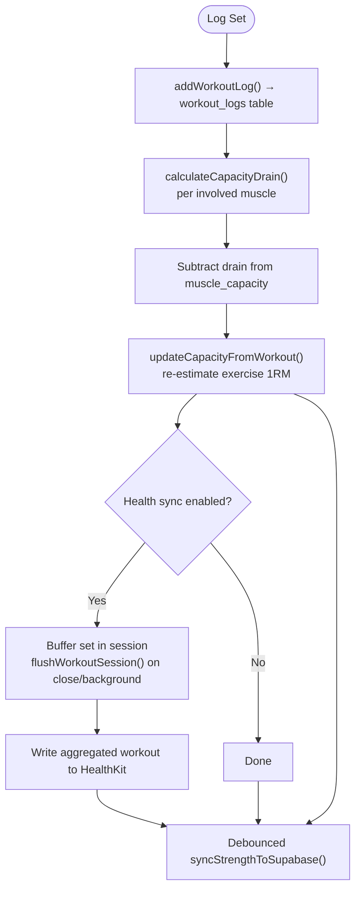

### Fatigue Drain Formula

For each muscle involved in an exercise:

```
cost = involvement × C₀ × (%1RM^p) × (reps^q) × metMultiplier × MET
drain = 100 × (1 - e^(-cost))
```

Default tunables (`helper/utils.ts`): `C₀=0.05`, `p=2.0`, `q=1.0`, `metMultiplier=0.15`. Users can override muscle involvement per exercise and recovery rates in Settings.

### Recovery Formula

Capacity recovers exponentially toward each muscle's max over time:

```
λ = -ln(1 - recoveryRate/100)
capacity(t) = maxCap - (maxCap - current) × e^(-λ × hours)
```

Recovery rates by muscle size (from `constants/Exercises.ts`):

| Category | Muscles | Rate (%/hour) | ~Full Recovery |
|----------|---------|---------------|----------------|
| Large | quads, hamstrings, glutes, lowerBack | 1.2–1.5 | 67–83 h |
| Medium | pecs, lats, upperBack, core | 1.8–2.2 | 45–56 h |
| Small | delts, biceps, triceps, calves, forearms | 2.5–3.5 | 29–40 h |

The home screen and `MuscleCapacitySection` apply recovery on load based on elapsed time since last update.

---

## 1RM Estimation

After each logged set, the app may update the exercise's estimated 1RM if the set qualifies as a PR candidate.

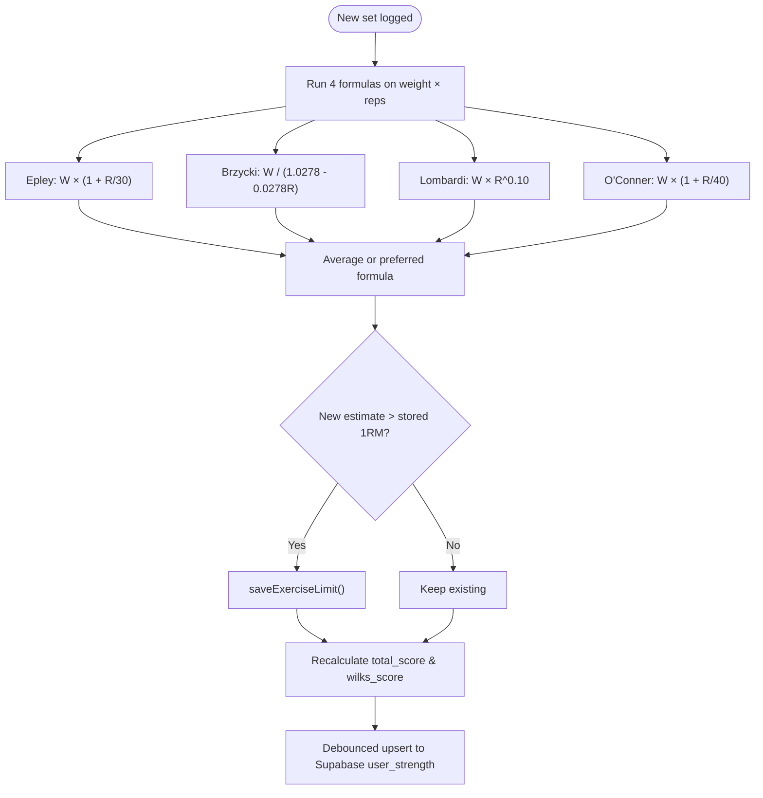

Core lifts used for the leaderboard strength score (`constants/StrengthMetrics.ts`): Squat, Deadlift, Bench Press, Overhead Press, Pull-Up, Barbell Row, Dumbbell Lunge, Push-Up, Triceps Dip.

---

## Leaderboard System

Rankings are read from Supabase's `user_strength` table. Writes happen from the client when 1RM data changes (debounced). Reads are cached in memory.

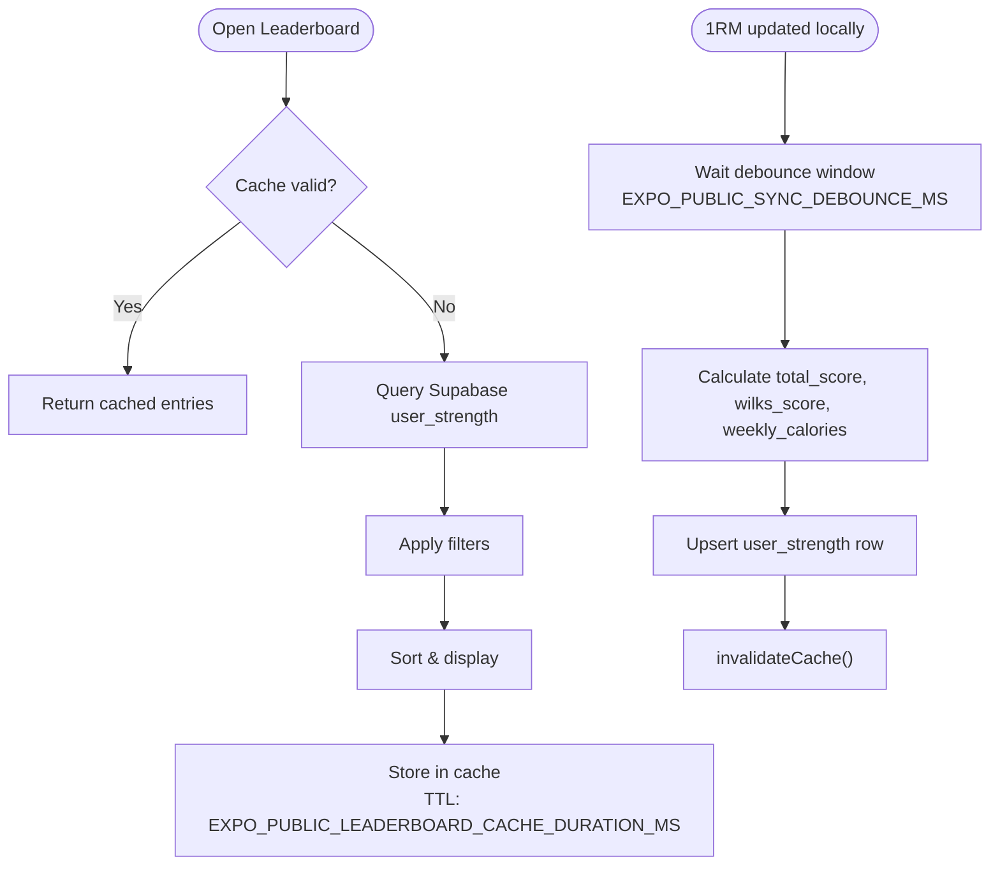

### Filter Dimensions

| Filter | Options |
|--------|---------|
| Sort | `total` (raw strength sum), `wilks` (bodyweight-adjusted), `calories` (weekly from Health) |
| Time | `all_time`, `weekly` |
| Location | `global`, `country` (via `expo-location`) |
| Score | `all`, `similar` (nearby bodyweight/gender) |

Schema and RLS policies: `docs/SUPABASE_LEADERBOARD_SCHEMA.sql`

---

## Health Sync

Health integration uses a platform-agnostic facade (`lib/healthSync.ts`) with lazy-loaded iOS/Android implementations.

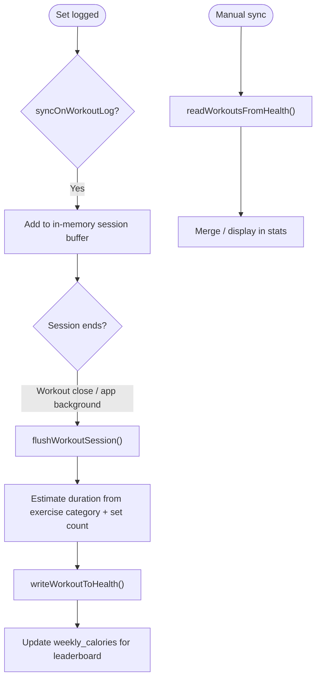

| Platform | Module | Package |
|----------|--------|---------|
| iOS | `lib/healthSyncIOS.ts` | `@kingstinct/react-native-healthkit` |
| Android | `lib/healthSyncAndroid.ts` | `react-native-health-connect` |
| Fallback | no-op | Used when native modules unavailable |

Setup guide: `docs/HEALTH_INTEGRATION_SETUP.md`

---

## Local Database Schema

Each authenticated user gets an isolated SQLite file: `sidetrack_{sanitizedUserId}.db`.

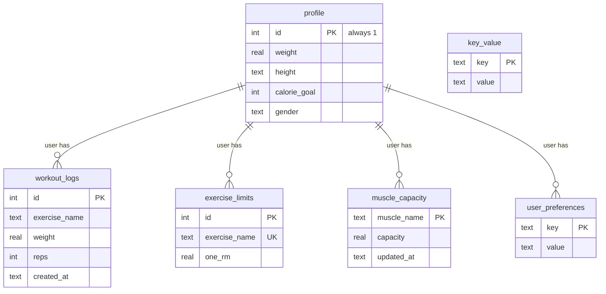

Key operations in `lib/database.ts`:
- `initializeDatabaseForUser()` / `closeDatabase()` — lifecycle tied to auth
- `addWorkoutLog()`, `getWorkoutLogs()` — session history
- `getMuscleCapacity()` / `updateAllMuscleCapacity()` — fatigue state
- `getExerciseLimit()` / `saveExerciseLimit()` — per-exercise 1RM
- `getPreference()` / `setPreference()` — flexible key-value store (onboarding flag, custom recovery rates, health sync options)
- `migrateFromKeyValue()` — one-time migration from legacy storage

View on device: `docs/VIEW_DATABASE.md`

---

## Exercise Catalog

`constants/Exercises.ts` defines ~30 exercises. Each entry includes:

- Available weight increments (plates or bodyweight offsets)
- Rep range (1–30)
- MET value (for fatigue cost)
- Muscle involvement map (fractional, sums to ~1.0 per exercise)

Example: **Bench Press** → `{ pecs: 0.6, triceps: 0.2, anteriorDeltoids: 0.2 }`

Users can customize involvement per exercise via `MuscleInvolvementEditor` (stored in `user_preferences`).

---

## Tech Stack

| Layer | Technology |
|-------|------------|
| Framework | [Expo](https://expo.dev/) SDK 53 + [React Native](https://reactnative.dev/) 0.79 |
| Language | TypeScript |
| Router | [Expo Router](https://docs.expo.dev/router/introduction/) v5 (file-based) |
| Styling | React Native StyleSheet (custom design system) |
| Animation | [React Native Reanimated](https://docs.swmansion.com/react-native-reanimated/) v3 |
| Icons | [@expo/vector-icons](https://docs.expo.dev/guides/icons/) |
| Local DB | [expo-sqlite](https://docs.expo.dev/versions/latest/sdk/sqlite/) |
| Backend | [Supabase](https://supabase.com/) (Auth + Leaderboard) |
| Health | [@kingstinct/react-native-healthkit](https://github.com/kingstinct/react-native-health) (iOS) / [react-native-health-connect](https://github.com/matinzd/react-native-health-connect) (Android) |
| Charts | [react-native-gifted-charts](https://github.com/Abhinandan-Kushwaha/react-native-gifted-charts) |
| Build | [EAS Build](https://docs.expo.dev/build/introduction/) + `expo-dev-client` |

> **Note:** New Architecture is enabled (`newArchEnabled: true`). Native modules (HealthKit, Apple Sign-In) require dev client or EAS builds — Expo Go alone is insufficient for full functionality.

---

## Project Structure

```
app/
  (protected)/           # Authenticated routes
    (tabs)/              # Main bottom-tabs navigation
      index.tsx          # Home / Randomize screen
      leaderboard.tsx    # Global & local rankings
      stats.tsx          # Workout history & analytics
      preferences.tsx    # User settings hub
    workout/             # Active workout screen
    settings/            # Deep settings pages
      fatigue.tsx        # Fatigue model parameters (C₀, p, q)
      recovery.tsx       # Per-muscle recovery rate overrides
      health-data.tsx    # Apple Health / Health Connect
      backup.tsx         # JSON export / import
      limits.tsx         # Manual 1RM overrides
    onboarding.tsx       # First-launch wizard
  api/auth/              # API routes for Supabase + Apple auth
  login.tsx              # Sign-in screen
  _layout.tsx            # Root providers (SupabaseAuth)
components/
  HumanMuscleMap.tsx     # SVG muscle map for fatigue visualization
  GoalsDisplay.tsx       # Current training goals UI
  SlotPicker.tsx         # iOS-style wheel picker
  MuscleCapacitySection.tsx
  MuscleInvolvementEditor.tsx
  BackupSettings.tsx
  ...
constants/
  Exercises.ts           # Exercise catalog with muscle maps, MET values
  MuscleGroups.ts        # 15 muscle group identifiers
  StrengthMetrics.ts     # 1RM formulas, Wilks, core lifts
context/
  SupabaseAuthContext.tsx
  ProfileContext.tsx
  UserCapacityContext.tsx
helper/
  utils.ts               # Fatigue drain, recovery, 1RM formulas
  username.ts            # Leaderboard username generation
lib/
  database.ts            # SQLite schema, CRUD, per-user DB files
  healthSync.ts          # Platform-agnostic health facade
  healthSyncIOS.ts       # HealthKit implementation
  healthSyncAndroid.ts   # Health Connect implementation
  healthSyncHelper.ts    # Session buffering, duration estimation
  leaderboardCache.ts  # In-memory cache with TTL
  onboarding.ts          # Onboarding completion flag
  backup.ts              # JSON backup export/import
  supabase.ts            # Supabase client singleton
docs/                    # Deep-dive documentation (see below)
```

---

## Data Backup & Restore

Users can export all local data as versioned JSON (`lib/backup.ts`):

- Profile, workout logs, exercise limits, muscle capacity, preferences
- Import restores into the current user's SQLite database
- Accessible from **Settings → Backup**

---

## Configuration

### Supabase

1. Create a Supabase project.
2. Run `docs/SUPABASE_LEADERBOARD_SCHEMA.sql` in the SQL Editor.
3. Set environment variables (see below).

### Environment Variables

| Variable | Required | Default | Purpose |
|----------|----------|---------|---------|
| `EXPO_PUBLIC_SUPABASE_URL` | Yes | — | Supabase project URL |
| `EXPO_PUBLIC_SUPABASE_ANON_KEY` | Yes | — | Supabase anon key |
| `EXPO_PUBLIC_LEADERBOARD_CACHE_DURATION_MS` | No | 600000 (10 min) | Leaderboard cache TTL |
| `EXPO_PUBLIC_SYNC_DEBOUNCE_MS` | No | 300000 (5 min) | Delay before syncing 1RM to Supabase |

Full details: `docs/ENVIRONMENT_VARIABLES.md`

### Apple Health (iOS)

HealthKit permissions and usage strings are configured in `app.json` via the `@kingstinct/react-native-healthkit` plugin. Enable HealthKit capability in your Apple Developer account for EAS builds.

### Location (Leaderboard)

`expo-location` provides country/city for local rankings. Permission string is in `app.json` → `NSLocationWhenInUseUsageDescription`.

---

## Quick Start

```bash
# Install dependencies
npm install

# Create .env with Supabase credentials (see docs/ENVIRONMENT_VARIABLES.md)

# Start the Expo dev server
npx expo start

# Then press:
#   i  → open iOS simulator (requires dev client for HealthKit)
#   a  → open Android emulator
```

For native modules, build a dev client:

```bash
npx expo run:ios
# or
npx eas build --profile development --platform ios
```

---

## EAS Build (Production)

```bash
# Configure EAS
npx eas build:configure

# Build for iOS
npx eas build --platform ios

# Build for Android
npx eas build --platform android
```

Bundle ID: `fun.explosion.sidetrack` · URL scheme: `sidetrack`

---

## Further Documentation

| Topic | File |
|-------|------|
| Fatigue model math | `docs/IMPROVED_FATIGUE_MODEL.md` |
| 1RM formulas & comparison | `docs/1RM_FORMULA_COMPARISON.md`, `docs/AUTO_1RM_IMPLEMENTATION.md` |
| User capacity / 1RM feature | `docs/USER_CAPACITY_FEATURE.md` |
| Muscle engagement UI | `docs/MUSCLE_ENGAGEMENT_DISPLAY.md` |
| Health integration setup | `docs/HEALTH_INTEGRATION_SETUP.md` |
| Leaderboard schema & indexes | `docs/SUPABASE_LEADERBOARD_SCHEMA.sql`, `docs/LEADERBOARD_OPTIMIZATION.md` |
| Leaderboard testing | `docs/LEADERBOARD_TESTING.md`, `docs/LEADERBOARD_QUICK_TEST.md` |
| Username generation | `docs/USERNAME_GENERATION.md` |
| View SQLite on device | `docs/VIEW_DATABASE.md` |
| Workout screen tabs | `docs/WORKOUT_PAGE_TABS.md` |

---

## License

No explicit LICENSE file. Assume all rights reserved unless otherwise stated.

---

Sweat and code by [Reuben Roy](https://github.com/reuben-roy).
